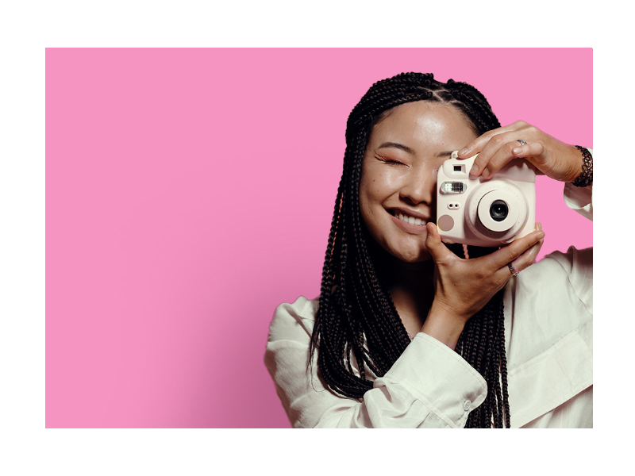

<!-- PROJECT LOGO -->
 

  

  <h3 align="center">Fujifilm | Instax Mini 9</h3>

  

    4th certification project assigned by freeCodeCamp as part of Responsive Web Design Curriculum
     
     
    <a href="https://github.com/praxeds/freecodecamp-product-landing-page">Live Demo</a>
    ·
    <a href="https://codepen.io/praxeds/pen/bGvwrzb">Codepen</a>
    ·
    <a href="https://www.freecodecamp.org/">freeCodeCamp</a>
  

<!-- TABLE OF CONTENTS -->

  
Table of Contents

  <ol>
    <li>
      <a href="#about-the-project">About The Project</a>
      <ul>
        <li><a href="#built-with">Built With</a></li>
      </ul>
    </li>
    <li><a href="#contact">Contact</a></li>
    <li><a href="#resources">Resources</a></li>
  </ol>

<!-- ABOUT THE PROJECT -->
## About The Project

* Objective: Build a CodePen.io app that is functionally similar to this: https://product-landing-page.freecodecamp.rocks.
* You can use HTML, JavaScript, and CSS to complete this project. Plain CSS is recommended because that is what the lessons have covered so far and you should get some practice with plain CSS. You can use Bootstrap or SASS if you choose. Additional technologies (just for example jQuery, React, Angular, or Vue) are not recommended for this project, and using them is at your own risk. Other projects will give you a chance to work with different technology stacks like React. We will accept and try to fix all issue reports that use the suggested technology stack for this project. Happy coding!

(<a href="#top">back to top</a>)

### Built With

* [Bootstrap v5.2](https://getbootstrap.com/)
* [Figma](https://www.figma.com/)
* [Photoshop](https://www.adobe.com/products/photoshop.html)
* [Github Pages](https://pages.github.com/)

(<a href="#top">back to top</a>)

<!-- CONTACT -->
## Contact

Juliana Praxedes - contact@julianapraxedes.com

Project Link: [https://github.com/praxeds/freecodecamp-product-landing-page](https://github.com/praxeds/freecodecamp-product-landing-page)

(<a href="#top">back to top</a>)

<!-- Resources -->
## Resources

* Icons by [Font Awesome](https://fontawesome.com/icons)
* Rainbow Text by [Mikulew](https://github.com/Mikulew/css-rainbow-text-animation)
* Photography by [Pavel Danilyuk](https://www.pexels.com/@pavel-danilyuk/)
* Photography by [Niles Gibbs](https://www.pexels.com/@niles-gibbs-3780878/)
* Photography by [Diana Titenko](https://www.pexels.com/@diana-titenko-1716093/)
* Photography by [Abdiel Rosario](https://www.pexels.com/@abdiel-rosario-1922524/)

(<a href="#top">back to top</a>)
